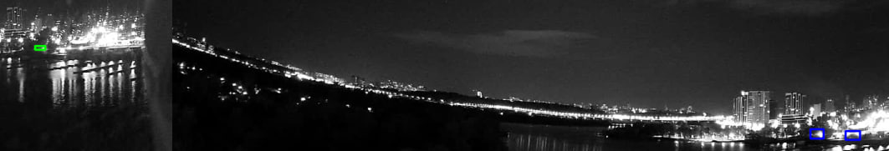
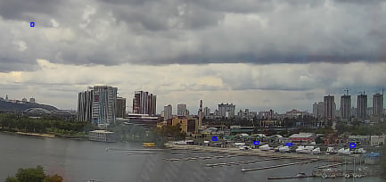

# Visual-Radar

The project I am working on. Just for practice.
Stereo surveillance on **OpenCV 4.x**. The app reads **two RTSP cameras**, time-syncs frames, rectifies them, detects motion, and **pairs L/R objects** along the epipolar line.

**Results**

  
  

**Next development steps**

1) Align the two cameras with each other-i.e., estimate their relative orientation angle in 3D space. The cameras are mounted at the window, so this should be done using distant landmarks as references.
2) Improve the C++ algorithm (reduce compiler usage).
